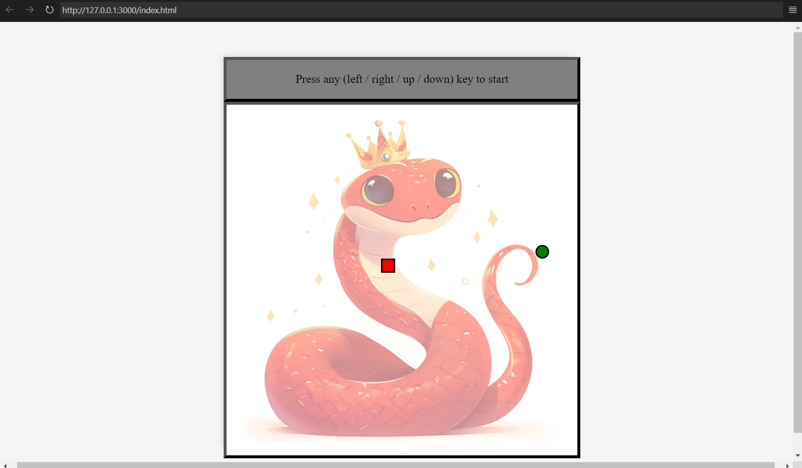
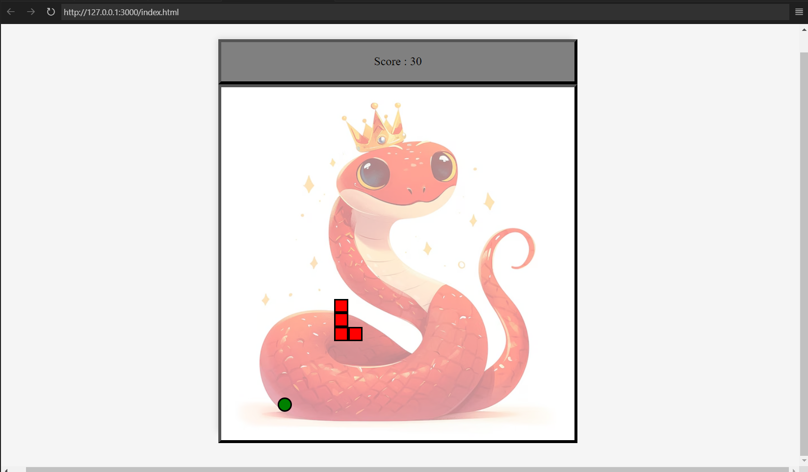

# 🐍 PiXel-Py 🎮  

A simple, pixel-style Snake game built with **HTML, CSS & JavaScript**.  

## 🎮 How to Play  
🕹️ **Press any arrow key** to start  
⬆️⬇️⬅️➡️ **Move the snake**  
🍏 **Eat food to grow**  
🚧 **Avoid walls & yourself!** 🐍 

## 🛠️ Tech Stack  
🔹 **HTML** – Structure  
🔹 **CSS** – Styling  
🔹 **JavaScript** – Game logic  


## 📸 Screenshots

### 🎯 Start Screen  


### 🕹️ Playing Screen  


## 🏗️ Installation  
1️⃣ Clone the repo:  
```bash
git clone https://github.com/LakshmiBotta/PiXel-Py.git
```
2️⃣ Open `index.html` in your browser.  
3️⃣ Enjoy the game! 🎉  

---

💖 Made with love & JavaScript ✨  
🐍 Play, have fun & don’t let the snake crash! 🎮  
